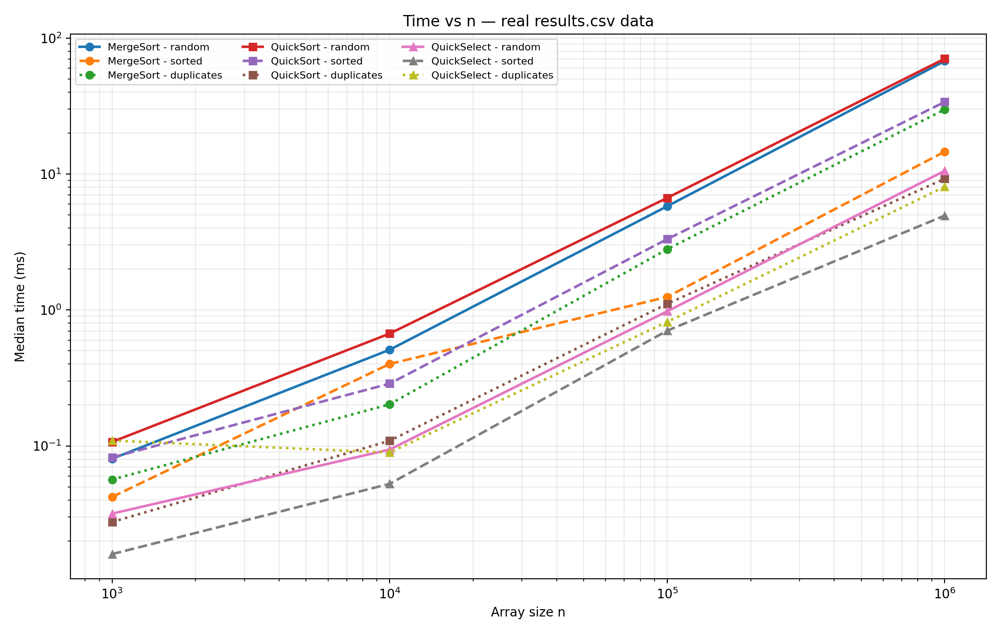
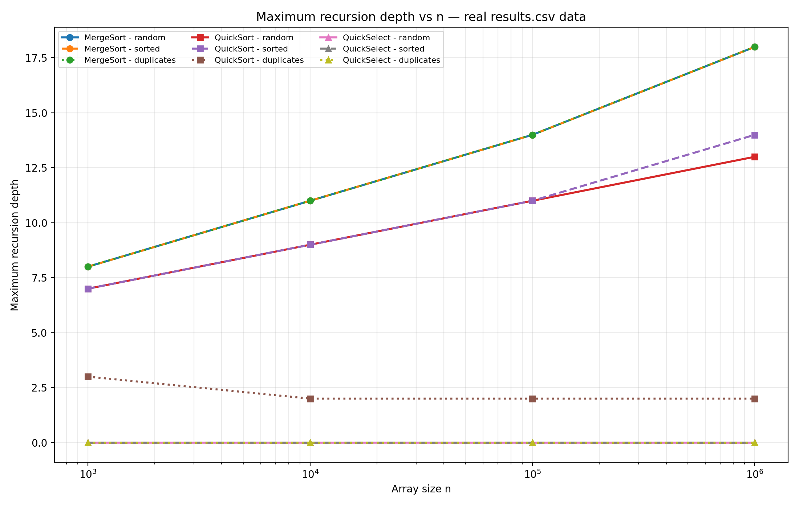
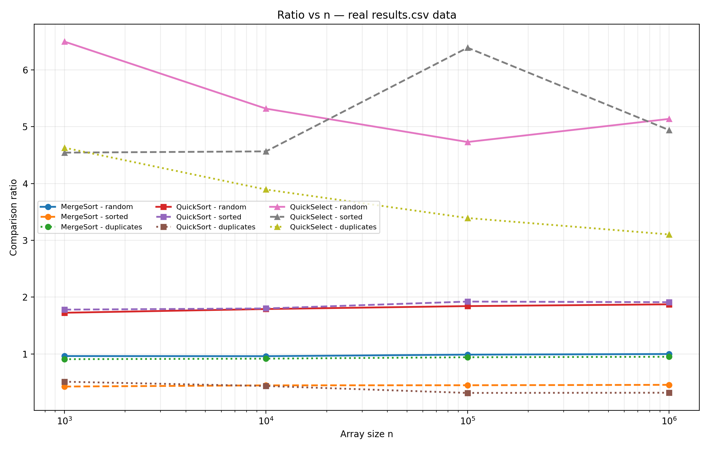

# DAA Assignment 1 — Fast Sorting & Selection Engine

## 1. Asymptotic Bounds

The table below shows the time complexity of the algorithms used in this assignment.

| Algorithm | Best Case | Average Case | Worst Case |
|---|---|---|---|
| MergeSort | Θ(n log n) — the array is divided into two parts and then merged | Θ(n log n) — the same process is repeated for all parts | Θ(n log n) — the array still has to be divided and merged |
| QuickSort | Θ(n log n) — the pivot divides the array into balanced parts | Θ(n log n) — random pivots usually give good partitions | O(n²) — the pivot can repeatedly give very unbalanced parts |
| QuickSelect | Θ(n) — the required element can be found after one partition | Θ(n) — only one part of the array is processed | O(n²) — the partitions can be very unbalanced |
| Insertion Sort | Θ(n) — the array is already sorted | Θ(n²) — elements may need to be moved several times | Θ(n²) — reverse sorted input causes many shifts |

MergeSort does not depend much on the original order of the elements. It always divides the array and then merges the sorted parts.

QuickSort depends more on the pivot. In this project, the pivot is selected randomly. The algorithm also uses 3-way partitioning, which is useful when the array contains many equal values.

QuickSelect does not sort the whole array. After partitioning, it continues only with the part where the k-th element can be located.

## 2. Recurrence Relations

### 2.1 MergeSort

MergeSort divides the array into two smaller arrays and sorts both of them.

The recurrence is:

T(n) = 2T(n/2) + Θ(n)

Here:

- a = 2
- b = 2
- f(n) = Θ(n)

For the Master Theorem:

n^(log₂2) = n

So this is Case 2 of the Master Theorem.

The final result is:

T(n) = Θ(n log n)

In my implementation, arrays with 15 or fewer elements are sorted using Insertion Sort. This can make the program faster for small parts, but the overall complexity is still Θ(n log n).

### 2.2 QuickSort

For the recurrence, I assume that the pivot divides the array into two approximately equal parts.

The recurrence is:

T(n) = 2T(n/2) + Θ(n)

Here:

- a = 2
- b = 2
- f(n) = Θ(n)

Using the Master Theorem gives:

T(n) = Θ(n log n)

In the actual program, the pivot is random, so it will not always divide the array exactly in half. However, random pivot selection makes balanced partitions more likely on average.

I also used smaller-side-first recursion. The smaller part is processed recursively, while the larger part is processed with a loop. This keeps the recursion depth small.

### 2.3 QuickSelect

QuickSelect is different because after partitioning it continues with only one side.

For a balanced split:

T(n) = T(n/2) + Θ(n)

Here:

- a = 1
- b = 2
- f(n) = Θ(n)

We have:

n^(log₂1) = 1

The linear partitioning work is larger than this value, so the result is:

T(n) = Θ(n)

This explains why QuickSelect can be faster than sorting when we only need one k-th smallest element.

## 3. Benchmark Results

I tested the algorithms with four different array sizes:

- 1,000
- 10,000
- 100,000
- 1,000,000

I used three types of input:

- `random` — random integer values
- `sorted` — already sorted values
- `duplicates` — random values from 0 to 9

Each test case was run five times. The median time was saved to `results.csv`.

### 3.1 Time vs n

This graph shows how the execution time changes when the array becomes larger.

For random arrays with 1,000,000 elements, MergeSort took about 67.7 ms and QuickSort took about 70.5 ms.

QuickSelect was much faster in this case. Its time was about 10.6 ms because it does not need to sort the whole array.

The input type also changes the results. QuickSort worked especially well with duplicate values. For 1,000,000 duplicate-heavy elements, its measured time was about 9.2 ms.

The graph shows that increasing the input size increases the running time of all three algorithms, but not at the same rate.

### 3.2 Maximum Recursion Depth vs n

This graph shows how deep the recursion became during the tests.

For MergeSort, the depth increased from 8 for n = 1,000 to 18 for n = 1,000,000. This is close to the expected logarithmic growth.

QuickSort also kept a relatively small depth. For n = 1,000,000, the maximum depths were:

| Input | Maximum depth |
|---|---:|
| Random | 13 |
| Sorted | 14 |
| Duplicates | 2 |

The sorted input did not cause a very large recursion depth. This is important because one of the requirements was to avoid StackOverflowError.

There was also a separate test for QuickSort with 100,000 sorted elements. The measured maximum depth was 10, while the allowed value was about 33. The test passed.

QuickSelect has depth 0 in the benchmark because its implementation uses a loop instead of recursive calls.

### 3.3 Ratio vs n

For MergeSort and QuickSort, I calculated the ratio using:

comparisons / (n × log₂(n))

For QuickSelect, I used:

comparisons / n

The idea is to see whether the number of comparisons grows approximately as expected from the theoretical complexity.

For MergeSort with random input, the ratio was close to 1. For example, it was about 0.96 for n = 1,000 and about 1.00 for n = 1,000,000.

For QuickSort with random input, the ratio was around 1.72–1.87.

The values are different for sorted and duplicate inputs because the algorithms do a different number of comparisons for these cases.

QuickSelect has more changes in the ratio. This is reasonable because the pivot is random, so different runs can require different numbers of comparisons.

## 4. Θ Check

The ratio can be used to make a simple experimental check of the expected Θ bound.

If:

f(n) = Θ(g(n))

then there should be constants c1, c2 and n0 such that:

c1·g(n) ≤ f(n) ≤ c2·g(n)

for all n ≥ n0.

The benchmark cannot prove the Θ bound mathematically. It only shows whether the measured results behave in a similar way to the theoretical prediction.

### MergeSort

For MergeSort, I used:

comparisons / (n × log2(n))

For random input, the ratio was close to 1. It was about 0.96 for n = 1,000 and about 1.00 for n = 1,000,000.

A rough experimental choice is:

- c1 ≈ 0.9
- c2 ≈ 1.1
- n0 = 100,000

This means that for large enough n, the measured ratio stays close to a constant value. This supports the expected Θ(n log n) behaviour of MergeSort.

For sorted input, the ratio was about 0.42–0.46.

For duplicate-heavy input, the ratio was about 0.91–0.95.

The exact values depend on the input type, but they remain in a relatively stable range as n increases.

### QuickSort

For QuickSort, I also used:

comparisons / (n × log2(n))

For random input, the ratio was approximately 1.72–1.87.

For sorted input, it was approximately 1.78–1.92.

For duplicate-heavy input, it was approximately 0.31–0.51.

For random input, a rough experimental choice is:

- c1 ≈ 1.5
- c2 ≈ 2.1
- n0 = 10,000

The ratio stays in a relatively stable range instead of increasing together with n. This is consistent with the expected average Θ(n log n) behaviour of QuickSort with random pivot selection.

The exact ratio is different for each input type because the number of comparisons depends on the partitioning.

### QuickSelect

For QuickSelect, the ratio is different because the expected complexity is Θ(n), not Θ(n log n).

I used:

comparisons / n

The measured ratio was approximately:

| Input | Ratio range |
|---|---:|
| Random | 4.73–6.50 |
| Sorted | 4.54–6.39 |
| Duplicates | 3.10–4.63 |

The ratio stays in a roughly constant range instead of growing with n.

A rough experimental choice is:

- c1 ≈ 3
- c2 ≈ 7
- n0 = 1,000

This supports the expected average Θ(n) behaviour of QuickSelect for the tested inputs.

Overall, the ratio plots give experimental evidence that the measured comparison counts are consistent with the expected asymptotic behaviour. However, these experiments are not a mathematical proof of the Θ bounds.

## 5. Discussion

The results were generally close to what I expected from the theoretical analysis.

MergeSort showed stable growth and its recursion depth increased slowly as the array became larger.

QuickSort also behaved close to n log n for the tested inputs. The random pivot helped it avoid a very deep recursion on sorted arrays.

The duplicate input was especially interesting for QuickSort. The 3-way partition made it possible to process equal values together, so the number of comparisons and the running time were lower than for some other inputs.

QuickSelect was faster in most of the benchmark cases because it only looks at the part that can contain the required element.

The measured time is not determined only by the algorithm. JVM warm-up, garbage collection, CPU cache and other programs running on the computer can affect the result.

The insertion sort cutoff can also affect the practical performance of MergeSort because small parts of the array are handled differently.

The five runs and the use of the median help reduce the effect of one unusually slow run.

The comparison count is also not exactly the same thing as execution time. Memory operations, swaps and other instructions can take different amounts of time.

Overall, the results were reasonably close to the expected theoretical behaviour.

## 6. Conclusion

In this assignment, I implemented MergeSort, QuickSort and QuickSelect in Java.

MergeSort uses one reusable helper array and an Insertion Sort cutoff for small subarrays.

QuickSort uses a random pivot, 3-way partitioning and smaller-side-first recursion. These techniques help keep the recursion depth bounded.

QuickSelect uses partitioning and continues only with the part that can contain the k-th smallest element.

I tested the algorithms on random, sorted and duplicate-heavy arrays with sizes from 1,000 to 1,000,000.

The benchmark results were saved in `results.csv`.

I also created three graphs for the report:

1. Time vs n
2. Maximum recursion depth vs n
3. Ratio vs n

The ratio results were generally consistent with the expected asymptotic growth of the algorithms.

The experiment also showed that real execution time can be different from theoretical complexity because of JVM warm-up, garbage collection, CPU cache and other implementation details.

Overall, the benchmark gave results that were consistent with the expected behaviour of the Divide-and-Conquer algorithms.